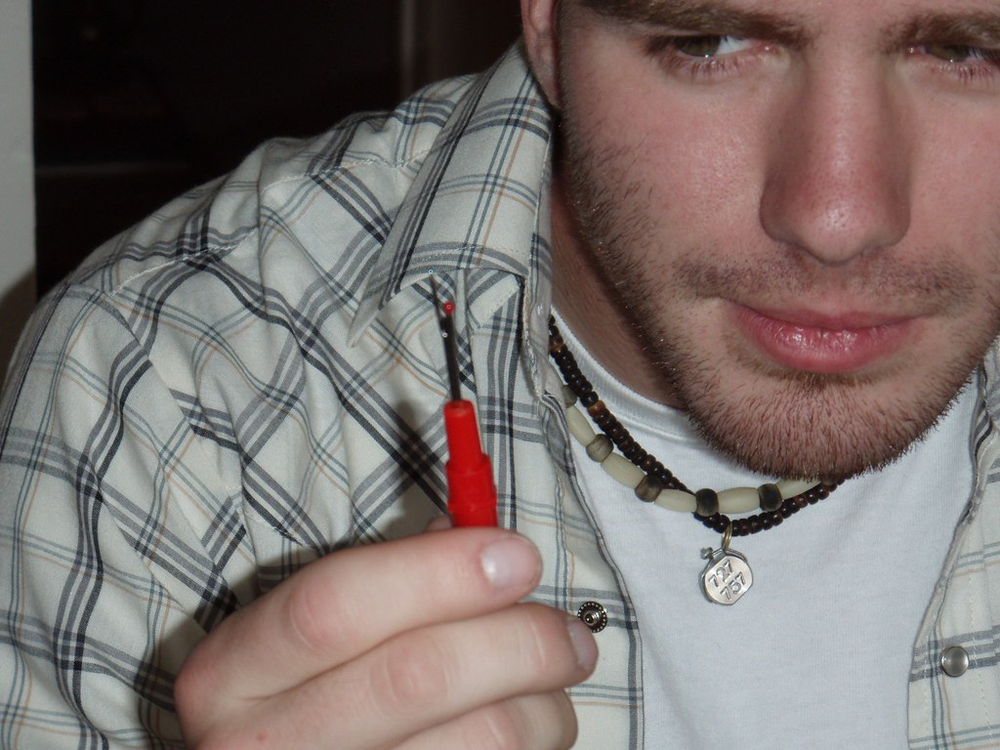
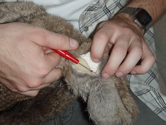
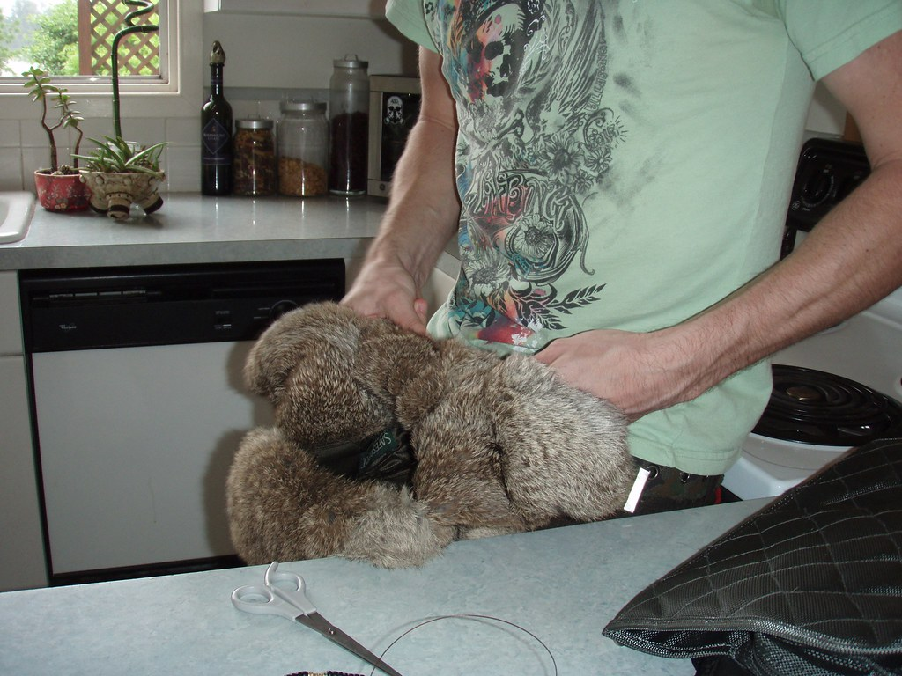
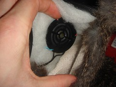
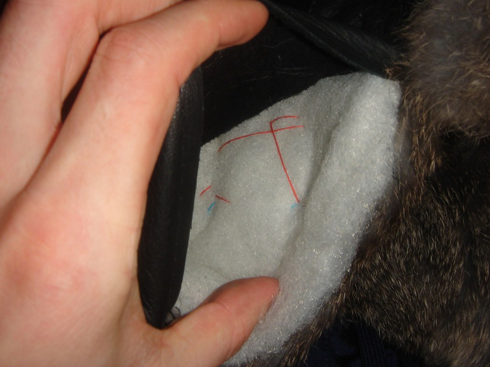
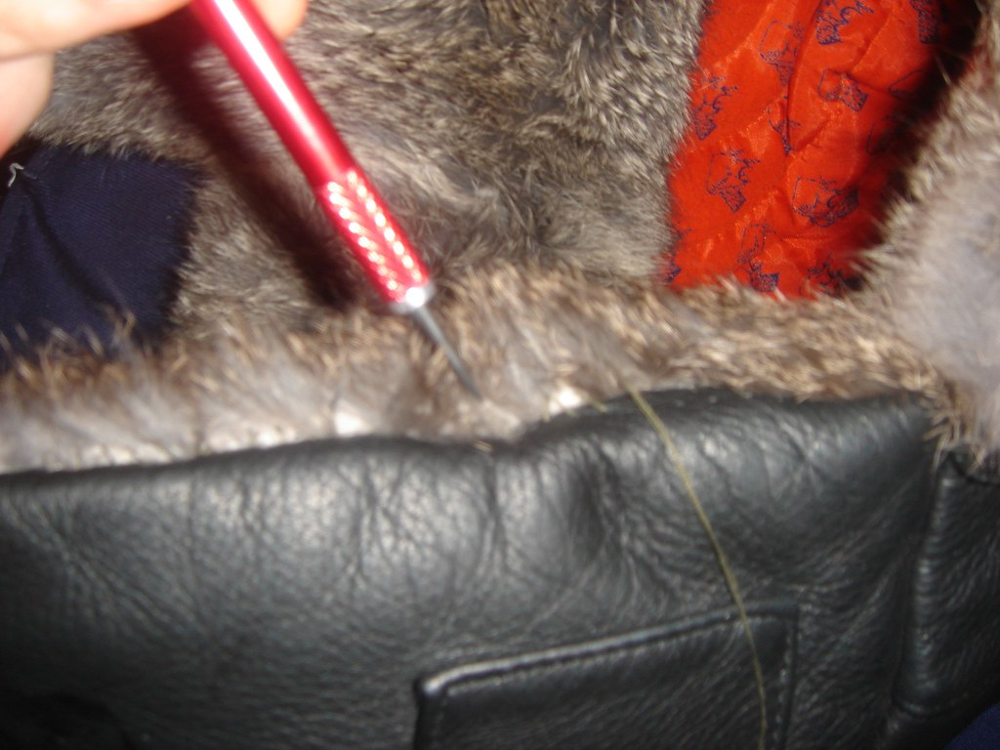
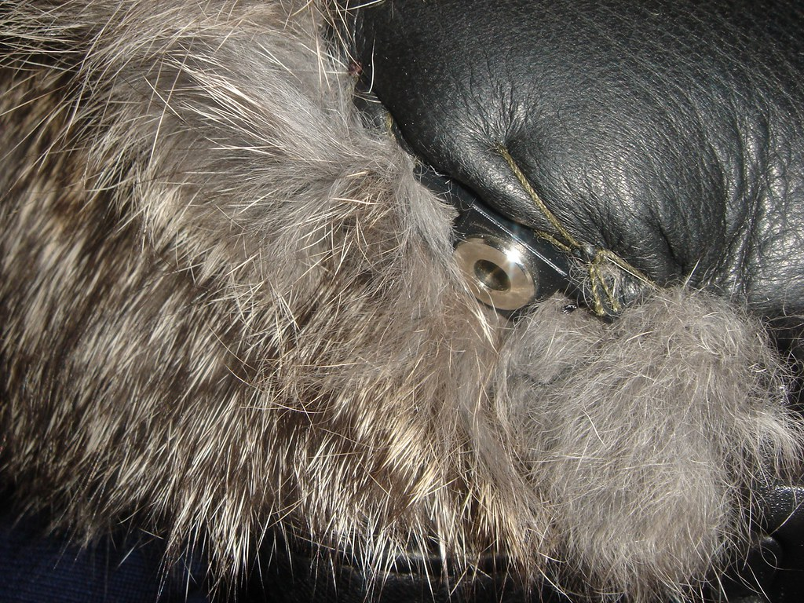
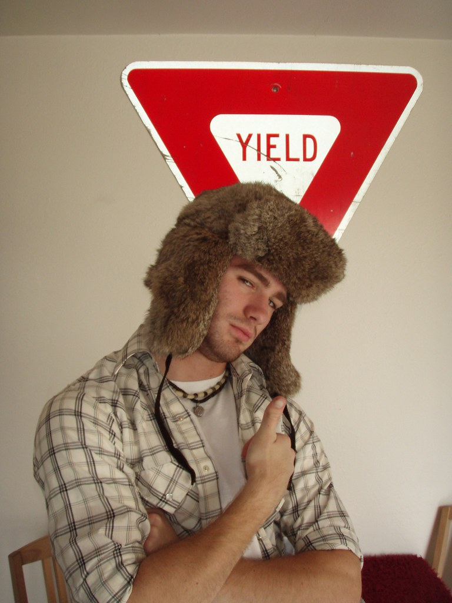

Who doesn’t love the classic appeal of the Russian Rabbit Fur Hat? It’s efficiant design is timeless, however, still contains the same technology it never had. It’s missing something fundemental to the 22nd century: music. We love our music, we want to take it everywhere, and we want it to be seemlessly integrated into our lives. So why not make more high-tech clothing? It’s finally within our grasp.

This is a simple hybrid of three technologies: a hat, some headphones, and a microphone.What supplies are require? [Mad Bomber Hat](http://www.amazon.com/gp/search?ie=UTF8&keywords=rabbit%20fur%20hat&tag=mudcube-20&index=apparel-index&linkCode=ur2&camp=1789&creative=9325) ($15-$75), pair of [Giro Tune Ups](http://www.amazon.com/gp/search?ie=UTF8&keywords=Giro%20Tune%20Ups&tag=mudcube-20&index=electronics&linkCode=ur2&camp=1789&creative=9325) ($24 to $59), [leather needle](http://www.amazon.com/gp/search?ie=UTF8&keywords=leather%20needle&tag=mudcube-20&index=garden&linkCode=ur2&camp=1789&creative=9325) ($1.29), [thread](http://www.amazon.com/gp/search?ie=UTF8&keywords=thread&tag=mudcube-20&index=garden&linkCode=ur2&camp=1789&creative=9325) ($0.25), [wax](http://www.amazon.com/gp/search?ie=UTF8&keywords=sewing%20wax&tag=mudcube-20&index=garden&linkCode=ur2&camp=1789&creative=9325) ($0.95), [seam ripper](http://www.amazon.com/gp/search?ie=UTF8&keywords=seam%20ripper&tag=mudcube-20&index=garden&linkCode=ur2&camp=1789&creative=9325) ($2.29), a bottle of wine ($27), fruit snacks ($1), and a pair of [scissors](http://www.amazon.com/gp/search?ie=UTF8&keywords=scissors&tag=mudcube-20&index=garden&linkCode=ur2&camp=1789&creative=9325) ($2.95). This project can cost you anywhere from $39 up to $140, not including your time. It took me 5 hours to complete this project (not including the initial idea, or shopping for the supplies). I wasted hours trying to learn how to sew leather + cut seams. You will have the advantage of learning from my mistakes. My friend completed his in about three hours. You can see them both on the bottom of the page. Let’s begin!

1. Remove speakers from padded enclosure: 
2. Cut seams in three places on hat. Be sure to try the hat on, and figure out exactly where your ears are going to be. Once you know, cut the seam out in that location on each ear flap. Cut one additional hole on the very bottom of one ear flap... this will be where you attach the audio jack:  
3. String speakers through hat. This is important, otherwise you will have wires hanging out. The idea is to insert one speaker into an ear flap, then pull the other one around the back of the hat on the inside until it comes out the other hole: 
4. Sew speakers into hat. Be sure the speaker is pointing towards your ears. Make sure they are perfectly aligned for maximum listening pleasure:  
5. Sew seams up. I used a little pokey thingie to push the seams in, using this method it appears to be sewn from the inside. The picture on the right shows how the audio jack should look once it's installed:  
6. The project was a success. They sound great, and keep your head warm while you're up at the mountain. Try it out yourself:  
