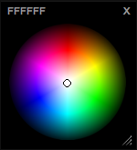

 I’ve prepared a new DHTML plugin, licencened under Creative Commons. It works perfectly on all Macintosh browsers, however, I haven’t had the opportunity to test on Windows… If there are bugs there, it would be great if someone could submit the fix’s… otherwise, you’ll have to wait for me to get around to finding a spare PC to test on.

The new plugin is based on our popular Sphere color chooser. The coolest part is that it’s resizable, you can make this thing as big as you want. Check it out [here](http://www.colorjack.com/software/dhtml+color+sphere.html).
