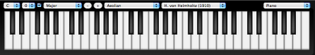

**UPDATE:** This project has been cancelled, the MIDIBridge (which takes this idea much further) is what you’re looking for;  [http://www.abumarkub.net/abublog/?p=505](http://www.abumarkub.net/abublog/?p=505)

Have you ever wanted to use MIDI in your Javascript or Flash project?  It’s been a long time dream of mine.  After a long search I came up with one solution that would provide the best support for the most computers (at present time) — utilizing Java’s [javax.sound.midi](http://java.sun.com/products/java-media/sound/doc-midi.html) interface through an . Introducing the MIDIPlugin providing the fundamental functions to create dynamic music & sound effects in your browser.

The MIDIPlugin requires that [Java](http://www.java.com/en/download/manual.jsp) and a [MIDI Soundbank](http://java.sun.com/products/java-media/sound/soundbanks.html) be installed on your computer. Some computers have these installed by default, others do not. More on computability later.

[](http://mudcu.be/labs/Piano/)

[Piano Theory](/piano/) was built utilizing the MIDIPlugin.  Although the MIDIPlugin works in Internet Explorer my piano webapp does not (at this time) — apologies to IE users.

**My pitch for MIDI support becoming a W3C standard**

Just as color and native primitives are the building blocks of graphics MIDI is an essential building block of music — we have for graphics, we’re lacking decent support for dynamic music generation.

The benefits of dynamic music generation is substantial — saving bandwidth, opening up a whole new realm of sense (the sense of audio) to dynamic content, allowing developers to create more interactive & immersive projects.  MIDI is a well defined framework that could be implemented into the W3C standards, as long as there is the support behind it.  With the motion that the web has been moving forwards recently, the possibility is ripe.

**The plugin is easy to use**

1. Include the MIDIPlugin in your projects to create a dynamic audio experience:
    
    ```js
    <applet archive="MIDIPlugin.jar" code="MIDIPlugin.class" height="1" id="MIDIPlugin" name="MIDIPlugin" width="1"><applet>
    
    ```
    
2. Test to see whether the browser supports the MIDIPlugin (has Soundbank installed and supports Java) with the following function in window.onload:
    
    ```js
    MIDIPlugin = document.MIDIPlugin;
    setTimeout(function () { // run on next event loop (once MIDIPlugin is loaded)
        try { // activate MIDIPlugin
            MIDIPlugin.openPlugin();
        } catch (e) { // plugin not supported
            MIDIPlugin = false;
        }
    }, 0);
    ```
    
3. When MIDIPlugin is false the user is either missing the [MIDI Soundbank](http://java.sun.com/products/java-media/sound/soundbanks.html) or [Java](http://www.java.com/en/download/manual.jsp) — prompt the user to install the appropriate software.  If the MIDIPlugin isn’t set to false… well then, the fun starts ;)Functions available to you within the MIDIPlugin object:
    
    ```js
    MIDIPlugin {
        setChannel(int)
        setMono(boolean)
        setMute(boolean)
        setOmni(boolean)
        setSolo(boolean)
        getInstruments(null)
        setInstrument(int)
        setBend(double) // 0.5 = default
        setPan(double) // 0.5 = center
        setPressure(double)
        setReverb(double)
        setSustain(double)
        setVelocity(double)
        setVolume(double)
        playNote(int) // 0 is low C - 1 is C# and so on
        stopNote(int) //
        playChord(string) // for instance [0,5,7].join(",")
        stopChord(string) //
        stopAllNotes()
        openPlugin()
        closePlugin()
    }
    ```
    
4. Remember to unload the plugin onbeforeunload, or your will have a loose connection hanging, which over time (multiple reloads) will result in the MIDI sound not working until you restart your browser:
    
    ```js
    window.onbeforeunload = function() {
        MIDIPlugin.closePlugin();
    };
    ```
    

**Licensed to use in your projects**

Released as [CC0](http://creativecommons.org/publicdomain/zero/1.0/) — this means you can use the MIDIPlugin in your project, and modify it to your hearts content without giving recognition, be that commercial or non-commercial.

**Git me**

Easily forkable on [GITHub](http://github.com/mudx/MIDIPlugin) or download the precompiled [.jar applet](http://mudcu.be/labs/Piano/MIDIPlugin-0.2.jar).

**Supported OS/Browsers**

MIDIDPlugin works on Macs out of the box.  Linux works out of the box depending on distribution, other times it requires Java SE to be installed.  Windows requires Java SE as well as the MIDI Soundbanks to be installed (the Windows version of Java SE doesn’t ship with MIDI Soundbanks included).  On the browser front the plugin works across the board:  Chrome, Opera, Firefox, Safari and IE.

**Other fun things in the name of music** [http://rhythmiclight.com/archives/ideas/colorscales.html](http://rhythmiclight.com/archives/ideas/colorscales.html) [http://www.alexisisaac.net/products/flashMidi/](http://www.alexisisaac.net/products/flashMidi/) [http://homepage3.nifty.com/sketch/flash/flmml050.swf](http://homepage3.nifty.com/sketch/flash/flmml050.swf) [http://code.google.com/p/abcjs/](http://code.google.com/p/abcjs/) [http://www.vexflow.com/](http://www.vexflow.com/) [http://en.wikipedia.org/wiki/General\_MIDI](http://en.wikipedia.org/wiki/General_MIDI)
