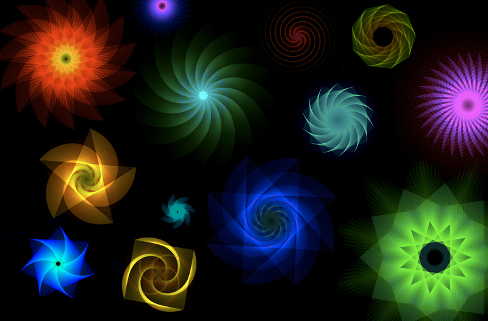
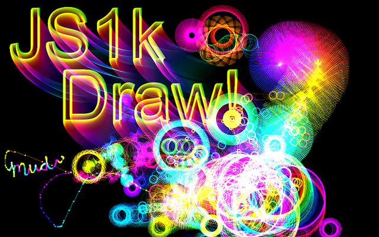
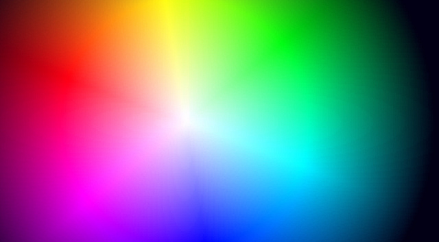

[JS1k](http://js1k.com/) is challenge presented by _Peter van der Zee_ to design the most creative use out of 1kb of Javascript. Many beautiful demos have been added in the first few days: [mr. doob](http://js1k.com/demo/45), [hyperandroid](http://js1k.com/demo/70), and [antimatter](http://js1k.com/demo/62). The challenge is addicting, “How much functionality can you fit in 1024 characters?”. Here are my results:

## [Breathing Galaxies](/labs/js1k/BreathingGalaxies.html)

Hypotrochoid with dynamically changing color and diameter. Use the keyboard to change shapes mid-stream, or move the mouse to create a new shape. “When I breath out my mind is at peace… When I breath in my body is at peace…” Create a ripple in the folds of time and space.

[](/labs/js1k/BreathingGalaxies.html "Open Breathing Galaxies demo")The code for the Breathing Galaxies, 1019 bytes:

```
window.onload=function(){C=Math.cos;S=Math.sin;U=0;w=window;j=document;d=j.getElementById("c");c=d.getContext("2d");W=d.width=w.innerWidth;H=d.height=w.innerHeight;c.fillRect(0,0,W,H);c.globalCompositeOperation="lighter";c.lineWidth=0.2;c.lineCap="miter";var e=0,h=0;d.onmousemove=function(k){if(window.T){if(D==9){D=Math.random()*15;f(1)}clearTimeout(T)}X=k.pageX;Y=k.pageY;a=0;b=0;A=X,B=Y;R=(k.pageX/W*999&gt;&gt;0)/999;r=(k.pageY/H*999&gt;&gt;0)/999;U=k.pageX/H*360&gt;&gt;0;D=9;g=360*Math.PI/180;T=setInterval(f=function(l){c.save();c.globalCompositeOperation="source-over";if(!l){c.fillStyle="rgba(0,0,0,0.01)";c.fillRect(0,0,W,H)}c.restore();i=25;while(i--){c.beginPath();if(D&gt;450||e){if(!e){e=1}if(D&lt;0.1){e=0}h-=g;D-=0.1}if(!e){h+=g;D+=0.1}q=(R/r-1)*h;x=(R-r)*C(h)+D*C(q)+(A+(X-A)*(i/25))+(r-R);y=(R-r)*S(h)-D*S(q)+(B+(Y-B)*(i/25));if(a){c.moveTo(a,b);c.lineTo(x,y)}c.strokeStyle="hsla("+(U%360)+",100%,50%,0.75)";c.stroke();a=x;b=y}U-=0.5;A=X;B=Y},9)};j.onkeydown=function(k){a=b=0;R+=0.05};d.onmousemove({pageX:300,pageY:290})};
```

## [Micro Sketchpad](/labs/js1k/MicroSketchpad.html)

Psychodelic text effect with a hypotrochoid drawing tool.

[](/labs/js1k/MicroSketchpad.html "Open Micro Sketchpad demo")The code for JS1k Draw, 1024 bytes:

```
window.onload=function(){Q=Math.random;C=Math.cos;S=Math.sin;H=0;w=window;d=document.getElementById("c");c=d.getContext("2d");c.fillRect(0,0,d.width=w.innerWidth*2,d.height=w.innerHeight*2);c.globalCompositeOperation="lighter";c.lineWidth=0.5;setTimeout(function(){c.font="210px Arial";n=360;while(n--){c.globalAlpha=n/1800;c.strokeStyle="hsl("+(n+110%360)+",99%,50%)";x=-n*C(n/360);y=250-S(n/360*2)*n/2.5;c.strokeText("JS1k",x+230,y+60);c.strokeText("Draw!",x+380,y+245)}c.globalAlpha=0.4},0);d.onmousedown=function(b){function a(l,j){X=l.pageX;Y=l.pageY;if(j=="down"){var s,p,h=X,g=Y,k=Q()*99,f=Q()*99,o=Q()*99,u=0;time=setInterval(function(){i=10;while(i--){c.beginPath();q=(k/f-1)*u;x=(k-f)*C(u)+o*C(q)+(h+(X-h)*(i/10))+(f-k);y=(k-f)*S(u)-o*S(q)+(g+(Y-g)*(i/10));if(s){c.moveTo(s,p);c.lineTo(x,y)}c.strokeStyle="hsl("+(H%360)+",99%,50%)";c.stroke();u+=360*Math.PI/180*2;s=x;p=y}H++;h=X;g=Y},5)}else{if(j=="up"){clearTimeout(time)}}}a(b,"down");d.onmousemove=function(f){a(f,"move")};d.onmouseup=function(f){a(f,"up")}}};
```

## [Spectrum DJ](/labs/js1k/SpectrumDJ.html)

Dynamically generated sphere controlled by mouse movements. I would love to see this made into a Audio Visualizer, there are a lot of cool effects that can be done very quickly with ColorMatrix’s. Here’s the same sphere in [Darkroom](http://mugtug.com/darkroom/) – allowing you to edit other attributes of the spectrum \[Tint, Temperature, Exposure, Contrast, ect\]. For instance, Exposure could be mapped to the bass beats. It might be cool.

[](images/SpectrumDJ.jpeg "Open full-size Spectrum DJ preview")The code for the Spectrum DJ, 928 bytes:

```
window.onload=function(){w=window;d=document.getElementById("c");c=d.getContext("2d");W=w.innerWidth;H=w.innerHeight;d.style.width=W+"px";d.style.height=H+"px";document.onmousemove=function(g){c.drawImage(image,0,0);var a=(g.pageX/W)*255-127,k=(g.pageY/H)*255-127,h=c.getImageData(0,0,d.width,d.height),f=h.data;for(var b=0,j=f.length;b&lt;j;b+=4){h.data[b]=f[b]-a;h.data[b+1]=f[b+1]+a;h.data[b+2]=f[b+2]+k}c.putImageData(h,0,0)};image=(function(){var k=document.createElement("canvas").getContext("2d"),a=300,h=a/2,f=(1/360)*Math.PI*2,j=W/H,e=-h/4,l=-h/2;d.width=k.canvas.width=h*j;d.height=k.canvas.height=h;k.fillRect(0,0,W,H);for(var b=0;b&lt;=359;b++){var i=k.createLinearGradient(e+h,l,e+h,l+h);i.addColorStop(0,"#000");i.addColorStop(0.5,"hsl("+((b+70)%360)+",100%,50%)");i.addColorStop(1,"#FFF");k.beginPath();k.moveTo(e+h,l);k.lineTo(e+h,l+h);k.lineTo(e+h+2,l+h);k.lineTo(e+h+5,l);k.fillStyle=i;k.fill();k.translate(e+h,l+h);k.rotate(f);k.translate(-(e+h),-(l+h))}return k.canvas})();c.drawImage(image,0,0)};
```

Each entry is required to work in the latest versions of Firefox, Safari, Chrome and Opera… my appologies to IE users, Microsoft does not yet support the [canvas element](http://www.whatwg.org/specs/web-apps/current-work/complete/the-canvas-element.html#dom-canvas-getcontext) in the HTML5 specs—it’s said to be scheduled for their next release.

**_Click, drag, and enjoy =)_**
