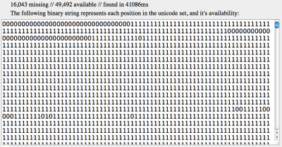
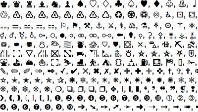
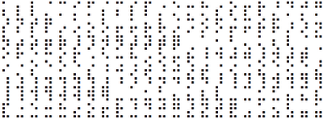

The **[Unicode Profiling Project](/labs/ucpp/)** was designed to gather statistics on unicode support across systems.  The software checks each symbol in your systems Unicode catalog (65,535 glyphs) to see which are visible on your computer using `<canvas>` and Javascript.

The data generated from your computer will help profile the state of unicode support on the web. Your computers unicode support, remote address, user agent and processing time will be submitted to the server upon completion of the test — a statistic analysis of the data will be published — no specific information about your computer will be published.

**Running the test:**

Once the [test](/labs/ucpp/) is initiated you’ll be able to watch the glyphs as they’re scanned with their related unicode block name.  It typically takes over a minute to scan an entire collection of unicode characters.  This is what the acid test looks like while being processed:

**Reading your profile:**

Once the processing has completed you will be presented with a string of binary representing what characters are visible, and which ones are unavailable or invisible (65,535 numbers). Here are the results from my Chromium browser running on OSX 10.6.4:

**Unicode characters:**

Now the fun part, click on “Show Available” — this may take a few seconds as you’re referencing tens of thousands of unicode characters at once:

[Unicode #65018](http://www.fileformat.info/info/unicode/char/fdfa/index.htm)

[Brail Patterns \[0x2800-28FF\]](http://www.fileformat.info/info/unicode/block/braille_patterns/utf8test.htm)

**Supported Browsers:**

The project fully supports Chrome, Firefox, Safari, and Opera.  Some false positives are produced in Internet Explorer as there is a unique “missing symbol” for every unicode block.

**Results on my Mac:**

- **Safari** 49,493 visible glyphs
- **Firefox 3.6** 49,428 visible glyphs _NOTE:  Each undefined symbol has a unique hash unless text size is `<=11`_
- **Google Chrome 7.0** 49,493 visible glyphs
- **Chromium 8.0** 49,492 visible glyphs
- **Opera 10.6** 47,672 visible glyphs _NOTE:  Supports different fonts in `<canvas>` than regular DOM_

**Results on my Windows:**

- **IE 9.0** 50,826 visible glyphs _NOTE:  Some false positives… each range has it’s own undefined symbol._
- **Firefox 3.6** 51,208 visible glyphs _NOTE:  Each undefined symbol has a unique hash unless text size is `<=10`_
- **Google Chrome 7.0** 47,267 visible glyphs _NOTE:  Textarea can have different unicode support than Div in some cases.  For instance, on my computer_ _ﰿ works in Textarea, but not in Div._
- **Opera 10.6** 56,024 visible glyphs _NOTE:  Supports different unicode in Canvas than Div and Textarea.  Also, Opera supports more unicode characters than other browsers by far, possibly included in the package?_

**Further Research:** 
- [http://unicode.org/](http://unicode.org/) 
- [http://en.wikipedia.org/wiki/Unicode](http://en.wikipedia.org/wiki/Unicode)
- [http://www.fileformat.info/info/unicode/](http://www.fileformat.info/info/unicode/)
