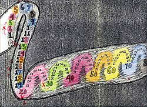
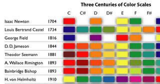
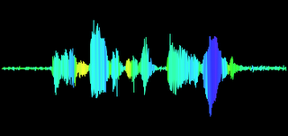
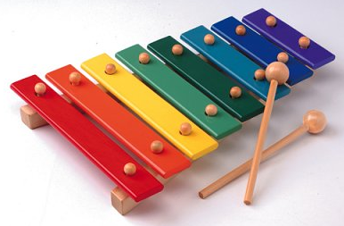

**UPDATE:** There is a more recent post on [Color Piano](/journal/2011/12/color-piano/).

[Color Piano Theory](/piano/) (CPT) was inspired by an interest in building an _educational application_ that utilizes colors in _teaching piano theory_.  CPT ties together chords, scales, inversions, octaves, and key signatures.  CPT is a visual interface for learning the keyboard.

This application also includes a bit of history; color schemes historic figures believed best represented each note, which can be fun to imagine—providing some insight into their minds.

**Visual/audial memory recognition**

To improve memory recognition, colors are mapped to the sounds on the keyboard, creating a [synesthetic](http://en.wikipedia.org/wiki/Synesthesia) experience. By picking a color-mapping that works best for you, these colors will give you a _visual cue to the note_ you’re playing.

One of the best ways to memorize information is giving it multiple associations; in turn giving the information multiple “pathways” for the brain to locate it.  With color added to the mix, we are building a memory recognition triangulation:  **sound** (measured in hz), **color** (in RGB), and **space** (the XY coordinate of key on the keyboard).

CPT also provides the [solfège](http://en.wikipedia.org/wiki/Solf%C3%A8ge) (_do, re, mi, fa, sol, la, ti, ect)_ to help people learn to sing by using the piano and a familiar sound to tune their voice.

**Historic mapping of color to sound**

The earliest known reference to the idea of mapping colors to sound came in _1704 by Issac Newton_ according to [Fred Collopy](http://rhythmiclight.com/index.html) author of [Three Centuries of Color Scales](http://rhythmiclight.com/archives/ideas/colorscales.html).  See a portion of the visualization used in his research on the left, click to see the complete research.

This leads me to a question brought to me recently, “_Why do so many of these people associate ‘red’ with ‘C’, ‘orange’ with ‘D’, ‘yellow’ with ‘E’, ‘green’ with ‘F’ and so on_?”  My best guess is many of these calculations were based on mappings to the rainbow, aka the [visible spectrum](http://en.wikipedia.org/wiki/Visible_spectrum);  where ‘C’ in western music has been historically thought of as a grounding, base note, the color ‘red’ is the shortest wavelength in the rainbow.

My best guess is _Lous Castel_ was mapping notes to the [visible spectrum](http://en.wikipedia.org/wiki/Visible_spectrum), organized from shortest wavelength to longest, ending with the ultra-violet range—although, why is “A#” and “B” flipped? Perhaps a sign of dyslexia? _Alexander Schriabin_ declared that “D#” sounds “steely with the glint of metal”, and “E” sounds “pearly blue the shimmer of moonshine”, and who can argue with that?  What does sound look like to you?

**Color Piano Project**

The [_Color Piano Project_](http://colorpiano.com/), developed by Dan Vlahos as part of his 1999 undergraduate graphic design thesis project at Massachusetts College of Art and Design, describes how such a piano would function.  He also provides an example of a [player](http://en.wikipedia.org/wiki/Player_piano)\-like [color piano](http://colorpiano.com/dv_c001_blk.html) to beautiful effect.

**Creating** **“MIDIPlugin”**

Being a big HTML5 fan, I decided to program the application in Javascript—the first hurdle was getting MIDI working in the browser to synthesize sound.

 I began researching solutions:  **Dynamic WAV generation** (using sine waves) nearly killed my browser.  Creating **MIDI from scratch in base64** and playing through Quicktime note by note didn’t work since the piano is dynamic and requires each key to have one `<code>&lt;audio&gt;</code>` tag. Unfortunately there seems to be a limit to how many tags can be played in a browser at one time, and how quickly their base64 codes can be switched in-between. Firefox recently added [amazing sound support](https://developer.mozilla.org/en/Visualizing_Audio_Spectrum), but **no access to the MIDI Soundbanks**_._ Perhaps someday Google will provide a **Native Client MIDI solution**.  …until then…

**Javascript `&lt;-&gt;` Java communication**

 After banging my head trying to get MIDI playing with native Javascript commands, I found one solution that would allow me to access MIDI across browsers: Javascript to Java communication.  The next step was creating the project [MIDIPlugin](https://github.com/mudx/MIDIPlugin), a **CC0 framework exposing the Java MIDI interface**.  Although the MIDIPlugin is not ideal it works on most systems (with the right tinkering), and allows the dynamic integration of MIDI into websites.

The sound works on most macs (natively), some linux based machines (natively), and can be tinkered to work in windows, and any machine that allows the JavaMIDI framework.  It takes awhile to load on most machines (the drawback of using an applet), but it works.  Read more on [how to tie the MIDIPLugin into your application](/journal/2010/08/dynamic-midi-generation-in-the-browser/).

**Presenting a synesthetic educational experiment**

The end result was the Color Piano Theory [web-app](http://www.chromeexperiments.com/detail/color-piano/), made public in Google’s [Chrome Experiments](http://www.chromeexperiments.com/detail/color-piano/) collection. Play around with the application—I hope it helps you create something beautiful.

**Synesthesia on the web:**

[http://www.aniwilliams.com/images/music\_chart-color\_wheel-lg.jpg](http://www.aniwilliams.com/images/music_chart-color_wheel-lg.jpg) [http://www.grotrian.de/spiel/e/spiel\_win.html](http://www.grotrian.de/spiel/e/spiel_win.html) [http://www.typorganism.com/visualcomposer/index.html](http://www.typorganism.com/visualcomposer/index.html) [http://www.ampledesign.co.uk/va/index.htm](http://www.ampledesign.co.uk/va/index.htm) [http://www.ultimaterhoads.com/viewtopic.php?f=6&t=4572](http://www.ultimaterhoads.com/viewtopic.php?f=6&t=4572)
