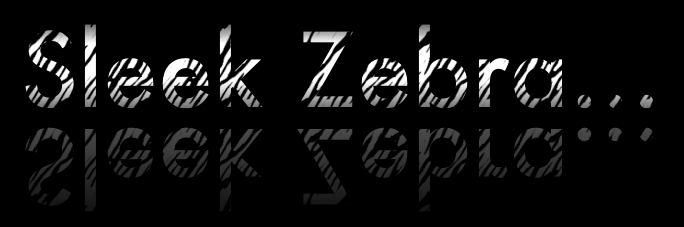
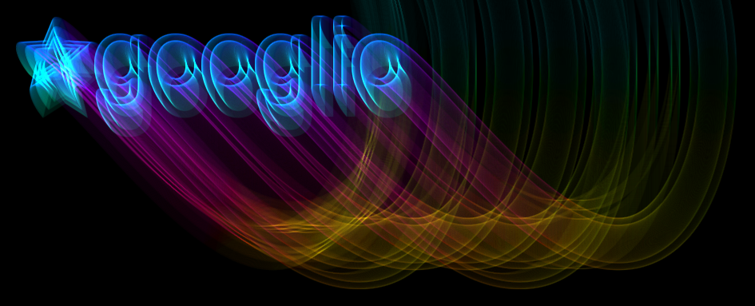
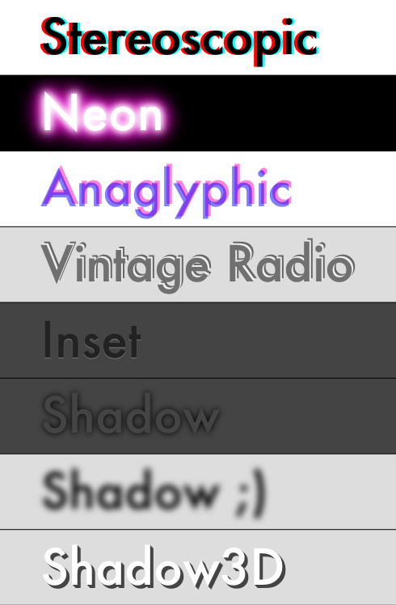

[HTML5 Rocks](http://www.html5rocks.com/) is a website that helps inspire developers and teach how to implement those shiny new HTML5 features in real world examples. They recently asked me to write an article for their website. Working on a project for Google was inspiring (even if there was no pay involved)!

… [Neon Rainbow Jitter](http://www.html5rocks.com/tutorials/canvas/texteffects/Text-Effects.html#neon+rainbow+jitter);

… [Sleek Zebra](http://www.html5rocks.com/tutorials/canvas/texteffects/Text-Effects.html#pattern+gradient+reflect) (inspired by [WebDesignerWall](http://www.webdesignerwall.com/demo/css-gradient-text));

… [Spaceage](http://www.html5rocks.com/tutorials/canvas/texteffects/Text-Effects.html#spaceage);

… and many other [fun](http://www.html5rocks.com/tutorials/canvas/texteffects/Text-Effects.html#shadow) [effects](http://www.html5rocks.com/tutorials/canvas/texteffects/Text-Effects.html#innershadow+pattern+gradient).  The following ones are using a CSS->Canvas converter; the CSS used in the converter was sourced from [Line25](http://line25.com/articles/using-css-text-shadow-to-create-cool-text-effects), and [Stereoscopic](http://lab.simurai.com/css/css3d/), and [Shadow 3D](http://pgwebdesign.net/blog/3d-css-shadow-text-tutorial);

