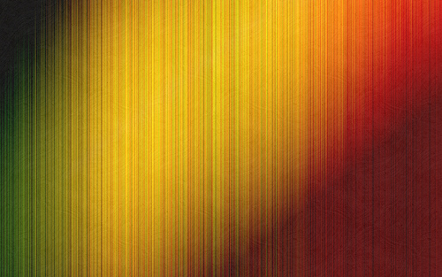
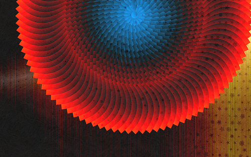
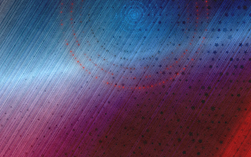

I worked on a future release of [BG](/bg/) a few months back, and am excited to share some screenshots! It’s exciting to be able to produce wallpapers **for my Desktop _in my Browser_**. Since creating these images, I’ve found that by using [JSZip](http://jszip.stuartk.co.uk/) and [Downloadify](https://github.com/dcneiner/Downloadify) the browser can generate HUGE, high-resolution and print-ready graphics. The largest file that I’ve successfully exported from Javascript is 17.5MB and 1,264 x 65,320 pixels… that’s enough resolution to print a 30×30 inch poster in 300DPI… more on this later! In the meantime, here are a few of the wallpapers that came out pretty nice:

