

Take photos with your webcam: mix and match combinations of filters to come up with your own unique effects. FilterStack includes a large collection of filter combinations to help get you started.

Once you’re happy with your image, you can save to your computer, or upload to Sketch.IO to share with your friends. Similarly, you can share your custom filters as well—this way your friends can use the same filter you made for their own pictures.

To enable editing, hover over the right side of the app—this will display thesidebar. Here you can: add filters, modify the values of each filter in the stack, reorganize which filter is processed first, enable/disable filters, or remove filters. Each of these controls can create vastly different effects.

Play around, share the results, and let us know what you think!

Available as a [Chrome Extension](https://chrome.google.com/webstore/detail/filterstack/inlmgknpbjingijmnphnnjakekmncnai?hl=en&gl=US) or [Web app](https://sketch.io/webcam-fx/).

[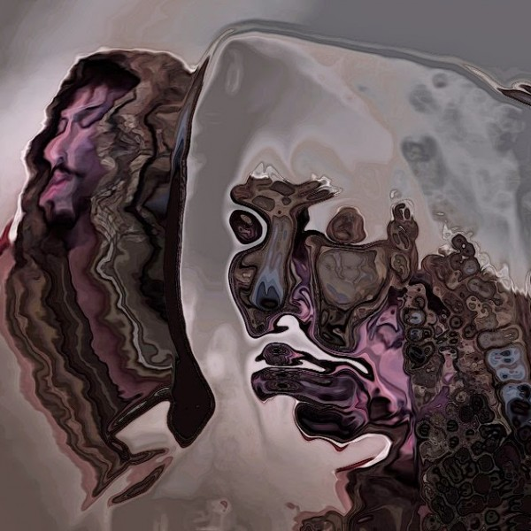](https://galactic.ink/journal/wp-content/uploads/2013/07/3a611e84-6702-4fae-b255-c748188d7939.jpg)

[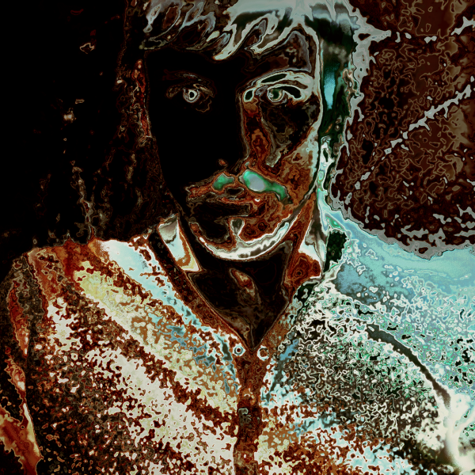](https://galactic.ink/journal/wp-content/uploads/2013/07/4c29056b-014a-46d2-a811-93d9b8e3b430.png)

[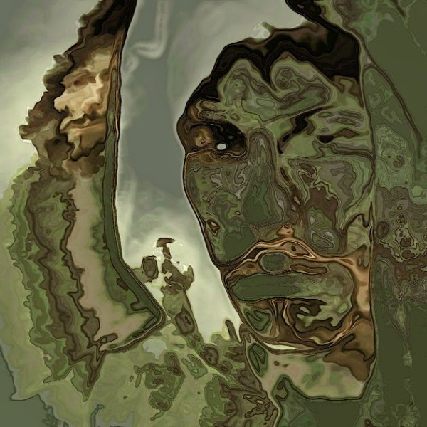](https://galactic.ink/journal/wp-content/uploads/2013/07/5b1fa9f0-4dc1-4fa3-a9a4-767797db5d5c.jpg)

[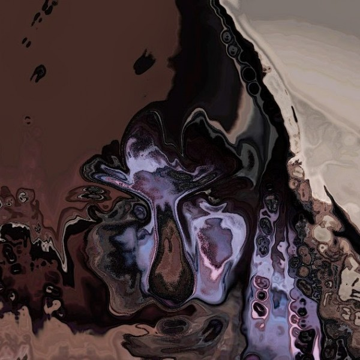](https://galactic.ink/journal/wp-content/uploads/2013/07/6fa21528-ff94-4461-afb6-d6371f4fbc3b.jpg)

[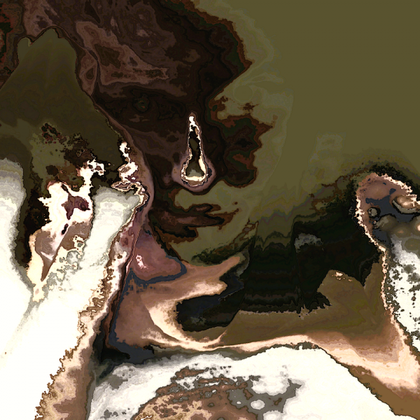](https://galactic.ink/journal/wp-content/uploads/2013/07/007.png)

[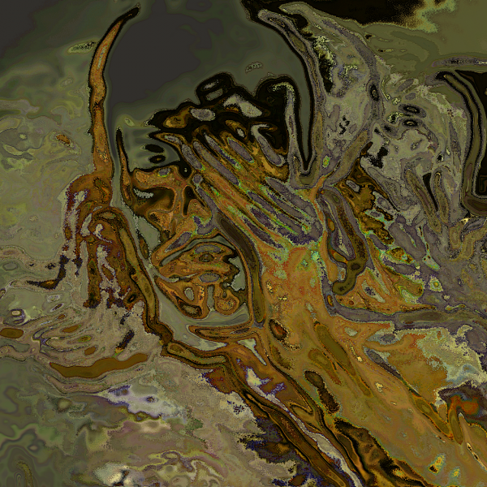](https://galactic.ink/journal/wp-content/uploads/2013/07/7d48a7f3-2667-49de-9d28-f54d0b896884.png)

[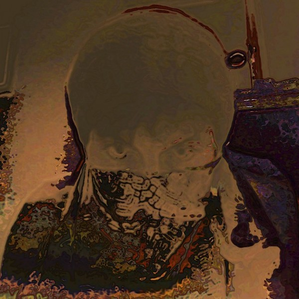](https://galactic.ink/journal/wp-content/uploads/2013/07/421a56b3-60c2-4cd5-b607-6249d54c7ece.jpg)

[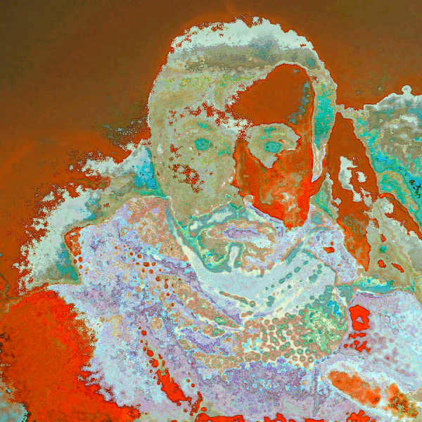](https://galactic.ink/journal/wp-content/uploads/2013/07/970c3962-32e0-452e-8279-8330ba00fce7.png)

[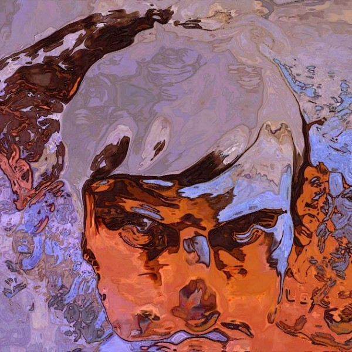](https://galactic.ink/journal/wp-content/uploads/2013/07/9144c5d9-4d4f-4baf-92e2-8bb5bed62c3d.jpg)

[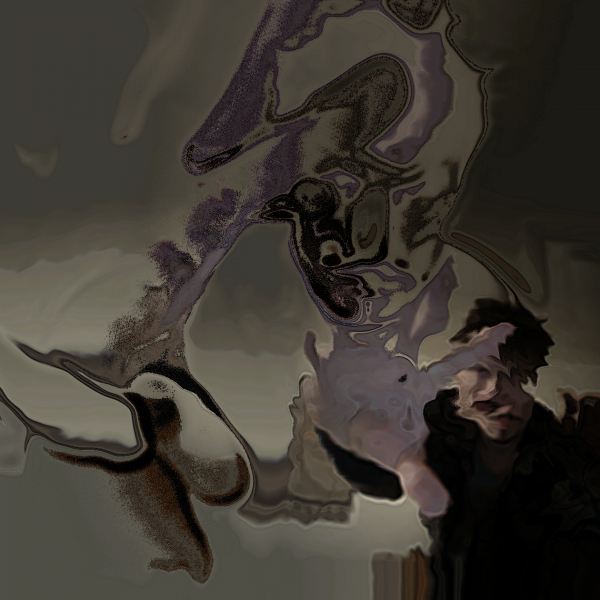](https://galactic.ink/journal/wp-content/uploads/2013/07/756398da-06b2-41cf-97fc-7319b3a52ac6.png)

[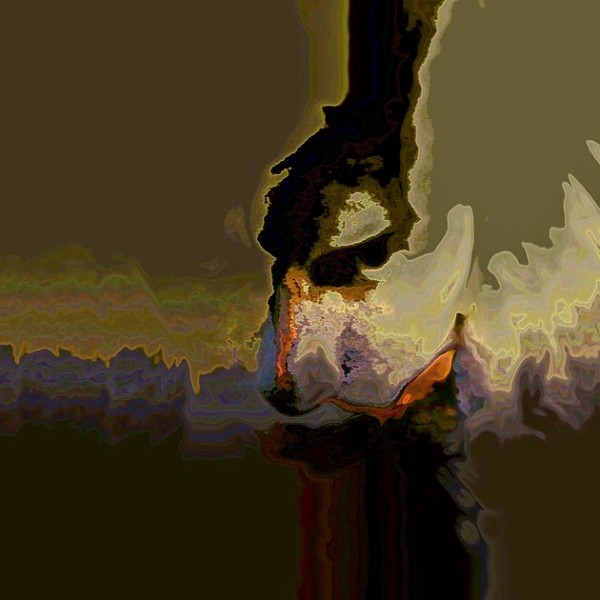](https://galactic.ink/journal/wp-content/uploads/2013/07/2909228b-a971-49e8-b822-08d5131b9617.jpg)

[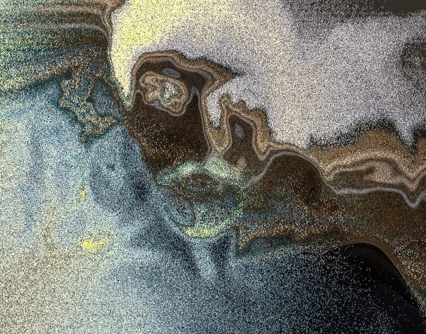](https://galactic.ink/journal/wp-content/uploads/2013/07/9007740921_c6783059f6_o.jpg)

[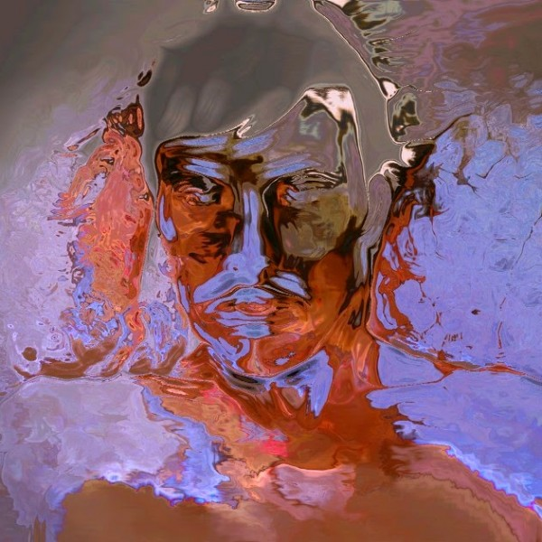](https://galactic.ink/journal/wp-content/uploads/2013/07/aec61ace-e152-4412-97cb-f5d5ebe2c5f3.jpg)

[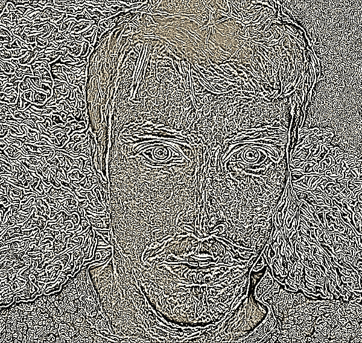](https://galactic.ink/journal/wp-content/uploads/2013/07/png-2-copy.png)

[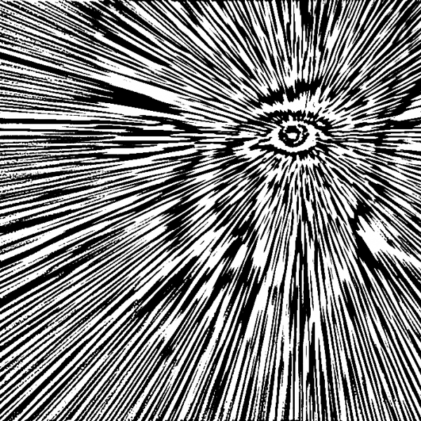](https://galactic.ink/journal/wp-content/uploads/2013/07/png-3.png)

[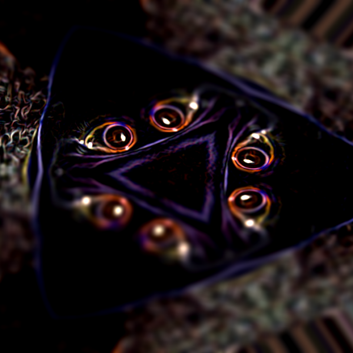](https://galactic.ink/journal/wp-content/uploads/2013/07/png-6.png)

[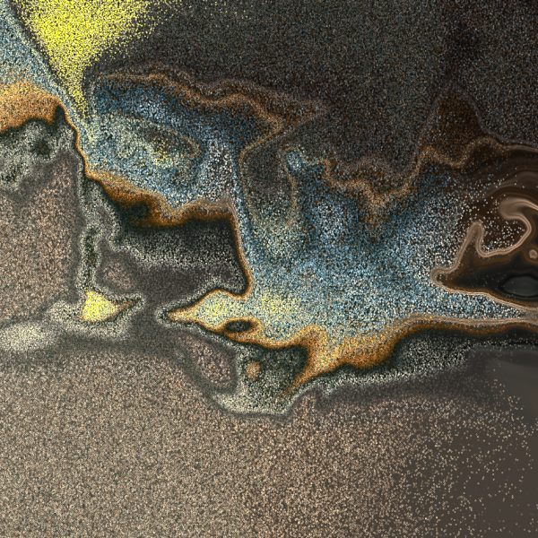](https://galactic.ink/journal/wp-content/uploads/2013/07/Screen-Shot-2013-06-09-at-5.34.44-PM.png)

