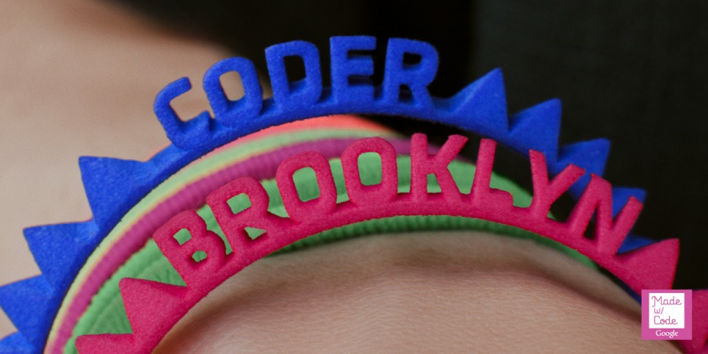
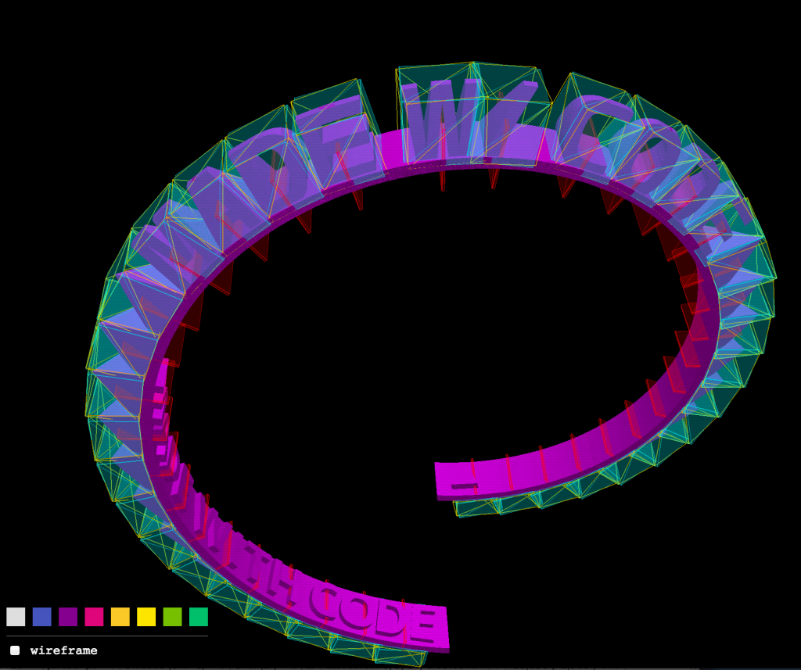

I recently had the pleasure of working on Google’s [Made with Code](https://www.madewithcode.com/) initiative with
the [Red & Co.](http://redandco.com/) creative studio and Mash a group of developers located in Portland Oregon.

My primary focuses were creating the renderer for the Bracelet Challenge along with the binary exporter that takes
peoples rendered bracelets and sends them to Shapeways for 3D printing. I have to say this job was probably the most
satisfying work that’s come my way! For three reasons: (1) The initiative of inspiring a more diverse range of people
interested in programming at an early age is awesome (2) Red & Co and Mash were friendly, fun and altogether great team
to work with (3) The work was challenging and allowed me time to work with more cutting edge technologies ?

The Bracelet renderer was developed with ThreeJS. My modest contribution back to the ThreeJS project can be found
here: [STLBinaryExporter](https://github.com/mrdoob/three.js/blob/master/examples/js/exporters/STLBinaryExporter.js)

The letters were generated by Red & Co. and exported into STLs. Since STLs are _huge_ uncompressed representations of 3D
objects (made up of tons of triangles) the files from there were converted into CTMs
using [OpenCTM](http://openctm.sourceforge.net/)'s ctmconv—this shaved 10’s of megabytes of the combined file-size of
the entire alphabet. The letters were then mapped to a spiral like lego bricks as conceived by Ryan Reece of Mash.
Here’s a screenshot of what that looked like:

The app also needed to run in Java (on Google’s AppEngine) so the server could render the bracelets the users created.
Although the app could very well send the [STL](http://en.wikipedia.org/wiki/STL_%28file_format%29) files directly to
Shapeways, we needed to control what was being sent so there was no unfortunate surprises! By rendering on the backend
we could be sure what was being sent to Shapeways. Instead of re-writing the code from scratch I decided to keep as much
as possible in Javascript. I first got the scripts running
in [Rhino](http://en.wikipedia.org/wiki/Rhino_%28JavaScript_engine%29) but it was too slow. I ran across the
project [Jav8](https://code.google.com/p/jav8/) and was quite happy with the results performing around 10x faster than
Rhino. I ended up writing some of the matrix math in Java and exposing the function to Javascript to speed things up
further.

From there, the bracelets are sent to Shapeways where they are printed with high-quality nylon plastic on 3D printers
from EOS, a German printer manufacturer who provided P760 SLS 3D printers to support the initiative.

The Bracelet challenge has a limited print run, so get them while you can! After that there will still be a lot of other
fun challenges on the Made with Code website.