[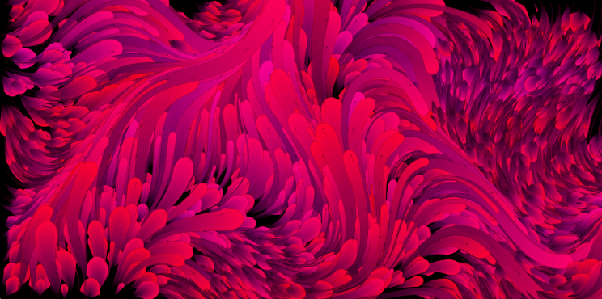](https://galactic.ink/journal/wp-content/uploads/2015/10/perlin-noise_19805217380_o.png)

I was recently asked to create artwork for the [C.A.R.D.S. Project](http://thecardsproject.com). Chris & John gave me no restrictions, and only one task: Create something interesting that fits on a 3.5 x 2.0 business card. For me, this was a dream project and an exciting excuse to play around with some generative algorithms!

My goal was to create an ‘ocean scene’. To do this I used Perlin noise vector fields, bezier curves, and color cycling. The ‘creatures’ or ‘waves’ are grown based on randomized parameters such as ‘width’, ‘length’ and ‘color’. The parameters change over time; some linearly, while others are mapped to cosine/sine waves and easing functions (this resulted in a more organic feeling).

I ended up submitting 250 unique cards to the project. Each card is composed of 10-frames and took 1-2 minutes to generate. Many were thrown out in the process! From there the cards were sent to [GifPop](http://gifpop.io/) for lenticular printing.

Here’s a few of my favorites (the squid in the first image is by Justin Windle):

[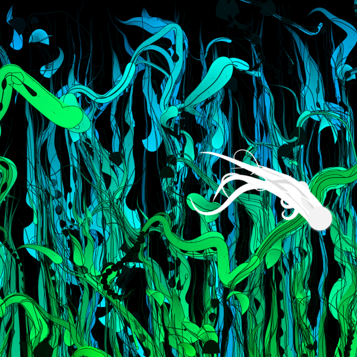](https://galactic.ink/journal/wp-content/uploads/2015/10/screen-shot-2015-08-11-at-055212-2_20314615179_o.png)

[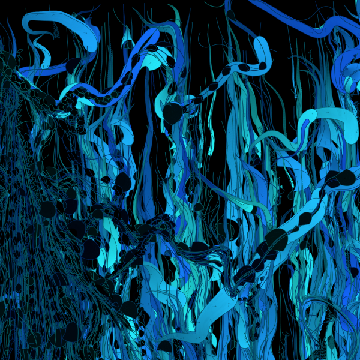](https://galactic.ink/journal/wp-content/uploads/2015/10/screen-shot-2015-08-11-at-053939_20313118610_o.png)

[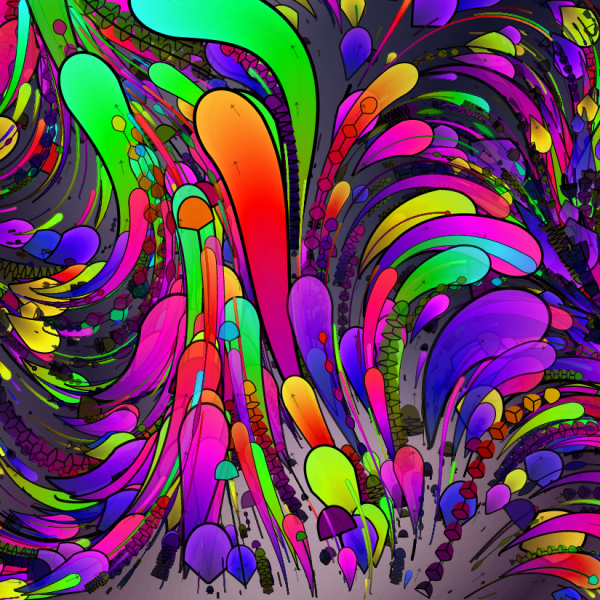](https://galactic.ink/journal/wp-content/uploads/2015/10/perlin-noise_20799892485_o.png)

[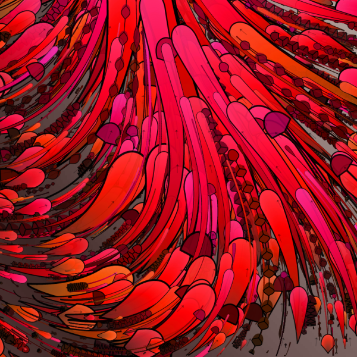](https://galactic.ink/journal/wp-content/uploads/2015/10/perlin-noise_20790376802_o.png)

[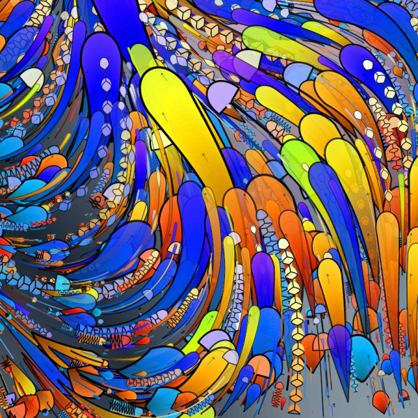](https://galactic.ink/journal/wp-content/uploads/2015/10/perlin-noise_20613175359_o.png)

[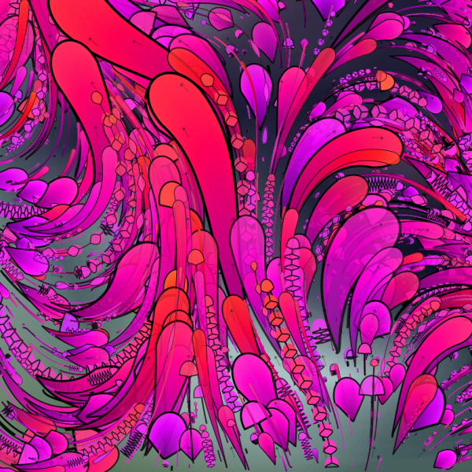](https://galactic.ink/journal/wp-content/uploads/2015/10/perlin-noise_20613161489_o.png)

[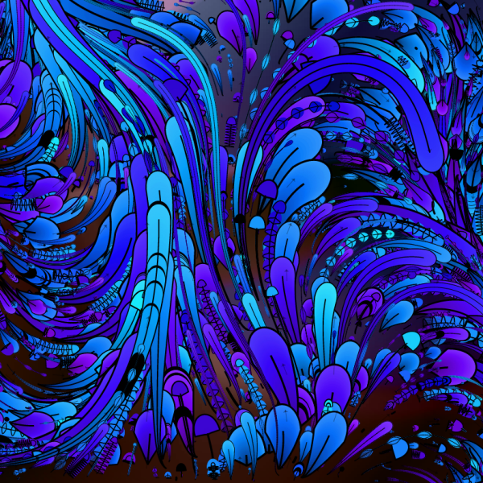](https://galactic.ink/journal/wp-content/uploads/2015/10/perlin-noise_20613042299_o.png)

[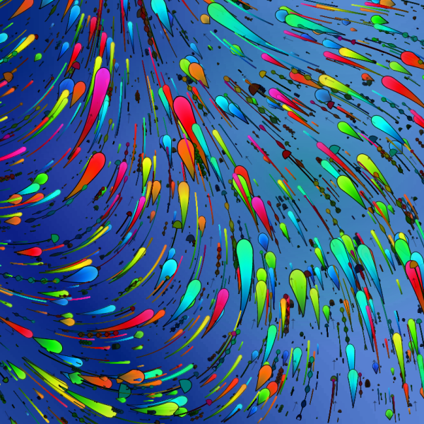](https://galactic.ink/journal/wp-content/uploads/2015/10/perlin-noise_20611897280_o.png)

[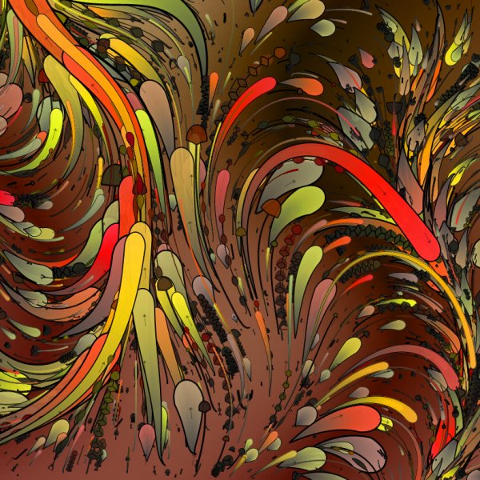](https://galactic.ink/journal/wp-content/uploads/2015/10/perlin-noise_20611818660_o.png)

[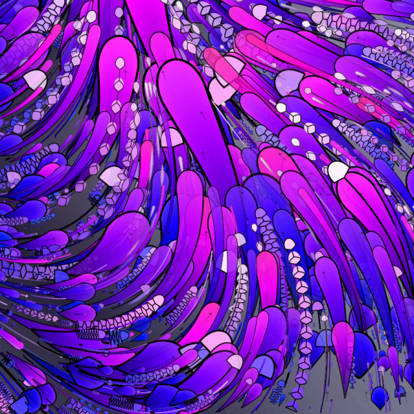](https://galactic.ink/journal/wp-content/uploads/2015/10/perlin-noise_20178989383_o.png)

[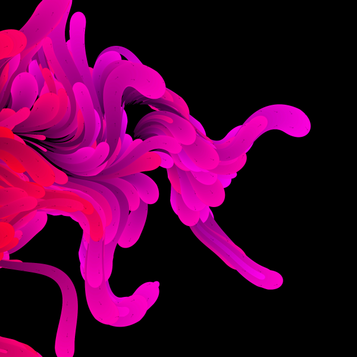](https://galactic.ink/journal/wp-content/uploads/2015/10/perlin-noise_19985452132_o.png)

[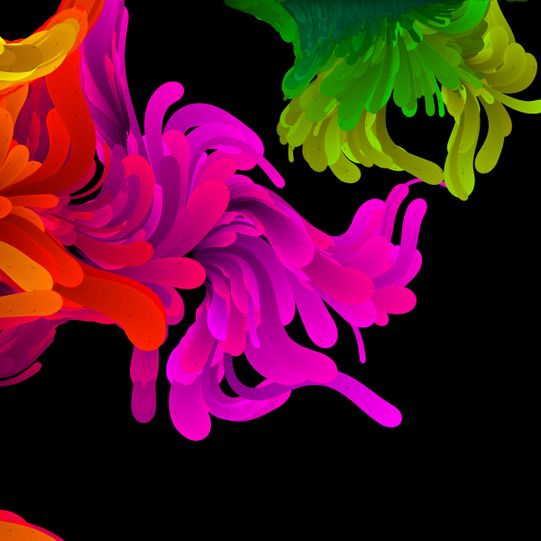](https://galactic.ink/journal/wp-content/uploads/2015/10/perlin-noise_19985443852_o.png)

[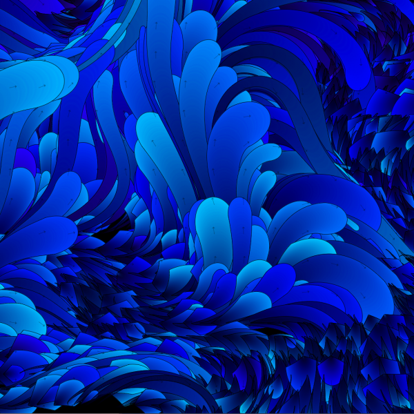](https://galactic.ink/journal/wp-content/uploads/2015/10/perlin-noise_19966948056_o.png)

[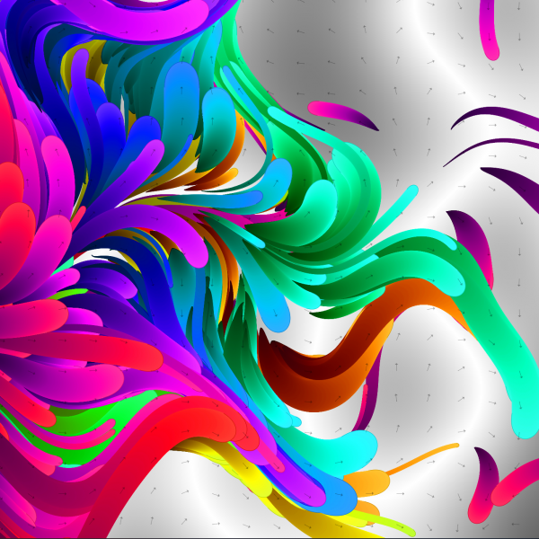](https://galactic.ink/journal/wp-content/uploads/2015/10/perlin-noise_19966917556_o.png)

[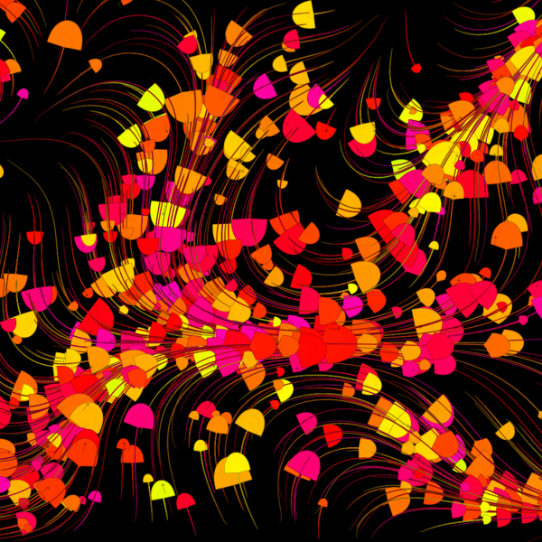](https://galactic.ink/journal/wp-content/uploads/2015/10/perlin-noise_19854886179_o.png)

[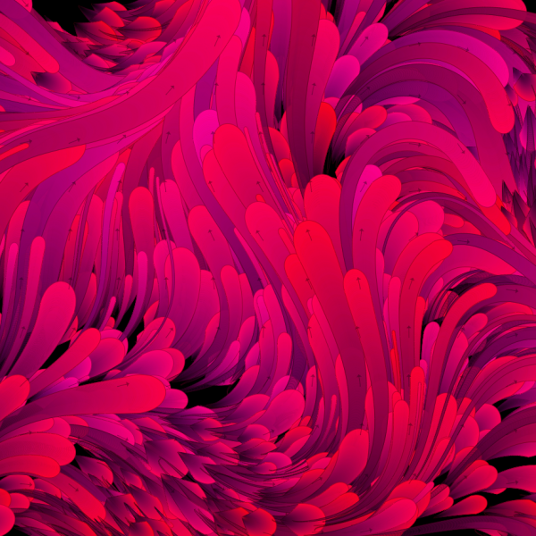](https://galactic.ink/journal/wp-content/uploads/2015/10/perlin-noise_19805217380_o.png)

[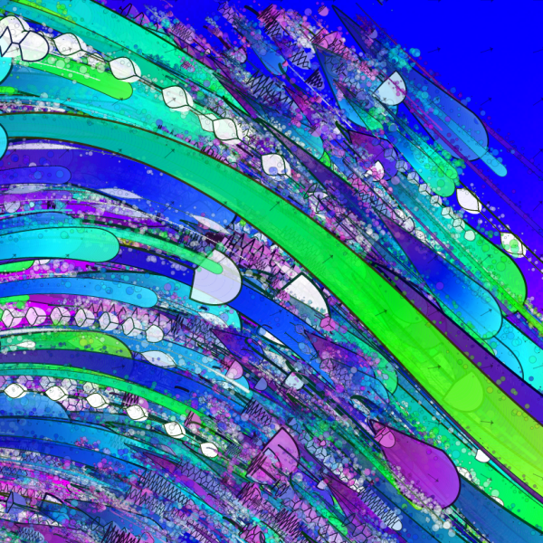](https://galactic.ink/journal/wp-content/uploads/2015/10/gradient2622scale00006865198035661689seed09447263730689883-1_20830072315_o.png)

[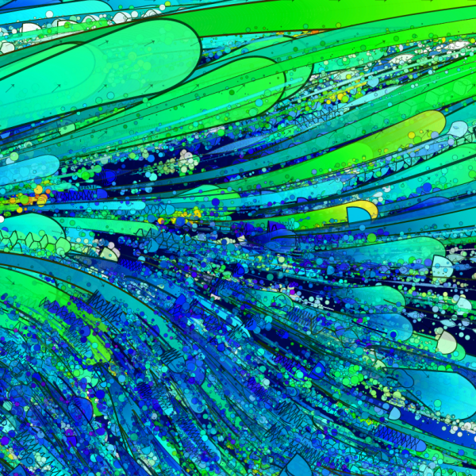](https://galactic.ink/journal/wp-content/uploads/2015/10/gradient114scale00010705421606872893seed09447263730689883-2_20641740428_o.png)

[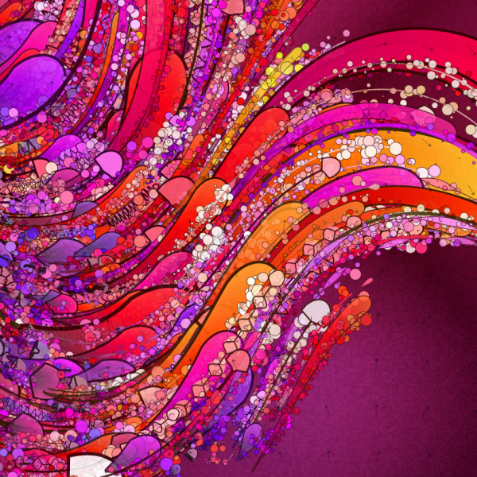](https://galactic.ink/journal/wp-content/uploads/2015/10/gradient86scale00011066297416606127seed09447263730689883-1_20641485088_o.png)

[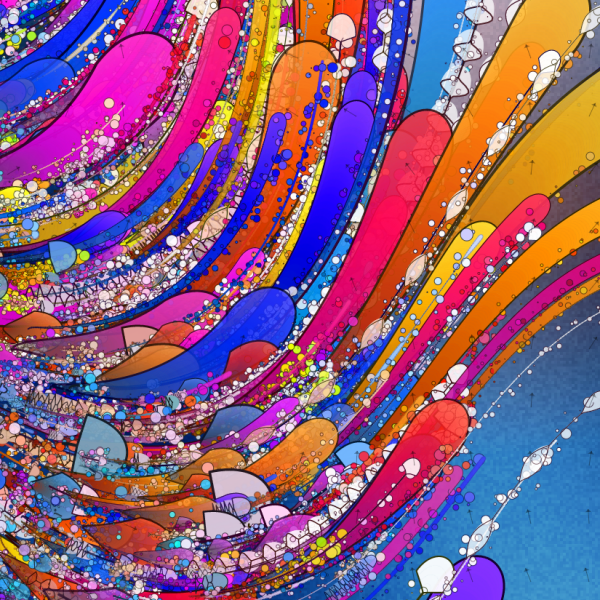](https://galactic.ink/journal/wp-content/uploads/2015/10/gradient59scale00007795513832380769seed09447263730689883-2_20206943934_o.png)

[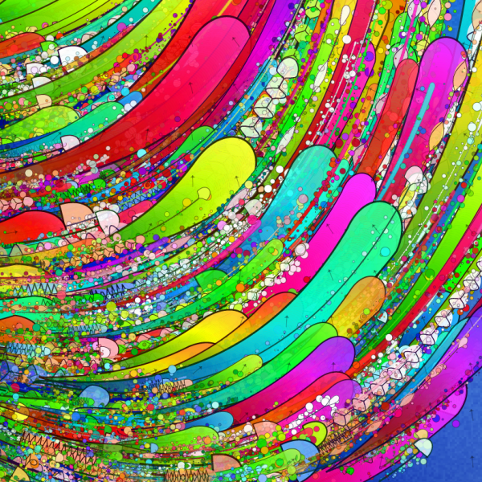](https://galactic.ink/journal/wp-content/uploads/2015/10/gradient47scale00005197800407278259seed09447263730689883-2_20207076014_o.png)

[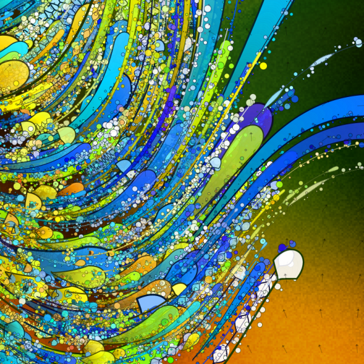](https://galactic.ink/journal/wp-content/uploads/2015/10/gradient10scale00008660784598281973seed09447263730689883-4_20641470340_o.png)

[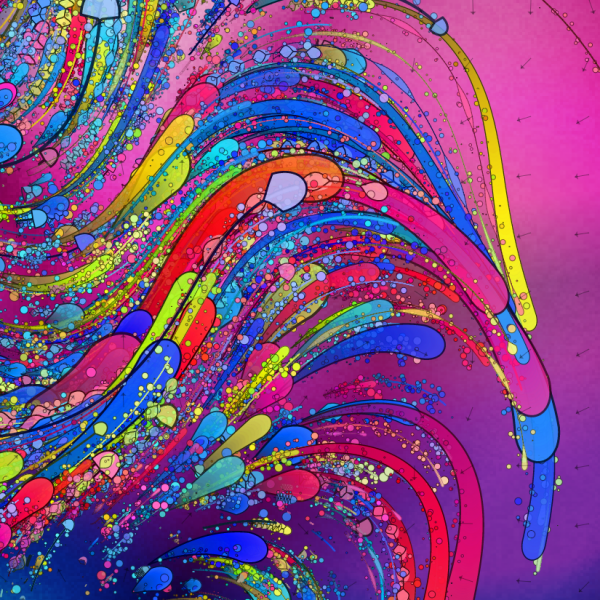](https://galactic.ink/journal/wp-content/uploads/2015/10/gradient5scale00015952325924743118seed09447263730689883-6_20819934432_o.png)
