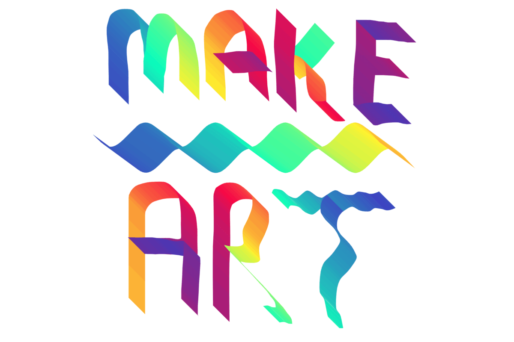

Hot off the press! Introducing Sketchpad v5.0 (codename Fancy Fox)

Sketchpad's exciting new features:

- Thousands of new [Clipart](https://sketch.io/sketchpad-v5.1/guide/#clipart) provided by OpenClipart!
- Hundreds of new [Fonts](https://sketch.io/sketchpad-v5.1/guide/#text) provided by Google Fonts!
- Entirely new [Sketchpad User Guide](https://sketch.io/sketchpad-v5.1/guide/#welcome) developed by Ryan Reece!
- **Paint into layers:** You can now use any brush to draw into any Shape or Image layer!
- **Mirror Brush:** A crowd favorite! The mirror brush, as it's name suggests, allows you to easily draw symmetrical imagery, similar to a mandala. For example the image above was created with this brush! We find this tool to be especially effective art therapy.
- **Tile Brush:** Perhaps the most versatile brush, the Tile Brush, allows you to stretch an image across any path that you draw. This can be a lot of fun! If you want, you can even drag an image from your Desktop onto the Stroke, and stretch that image along the path you draw. Experiment for joys abound.
- **Align layers:** When using the Select tool you can now align layers in respect to other layers. The new methods supported are: _top, left, right, bottom, horizontal, vertical_
- **Distribute layers:** When using the Select tool you can now distribute layers in respect to other layers. The new methods supported are: _horizontal, vertical_

We hope you enjoy Sketchpad v5.0!

As always feel free to drop us a [message](https://sketch.io/contact.html) and let us know what you think :)

 

