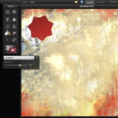
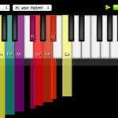
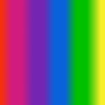
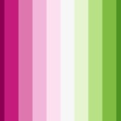
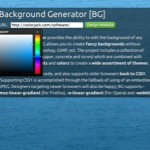
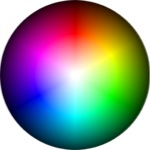
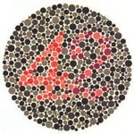

## [Sketchpad 3.0](https://sketch.io/sketchpad/ "Sketchpad 3.0")

Sketchpad is a free application allowing you to create beautiful landscapes and images. Sketchpad includes a number of drawing tools, including the _Text, Shape, Spirograph, Brush, Calligraphy, Pencil, Paint-Bucket, and Stamp_ tool. It also includes generic drawing utilities, such as the _Marquee, Crop, Eraser, and Color-Picker_ tools.

## [Color Piano 2.0](/piano/ "Color Piano 2.0")

Color Piano Theory (CPT) ties together chords, scales, inversions, octaves, and key signatures. CPT is a visual interface for learning the keyboard. Memorize information by giving it _multiple associations_; in turn giving the information multiple “pathways” for the brain to locate it. With color added to the mix, our brains can build a memory recognition triangulation: sound—measured in _hz_, color—measured in _RGB_, and space—the _XY_ coordinate of key on the keyboard. CPT also provides the solfège, _do, re, mi, fa, sol, la, ti, and so on_, to help people learn to sing by using the piano and a familiar sound to tune their voice.

## [ColRD: Gradient Creator](http://colrd.com/create/gradient/ "ColRD: Gradient Creator")

Dazzling gradients are at your fingertips. This unique interface allows you to think of gradients as blocks of color, in the same way you would create palettes of color. Drag & drop GIMP’s .ggr format into your browser to view and edit instantly! Export into _CSS, GGR_, or create your own personalized _Gradient Desktop Wallpaper_.

## [ColRD: Palette Creator](http://colrd.com/create/palette/ "ColRD: Palette Creator")

A natural progression from the Color creator, the palette creator allows you to _add, remove, and organize collections of colors_ in your browser. You can then save them to ColRD, as with the Gradient and Palette creators, or export them into _CSS, JPEG, Photoshop or Illustrator_ formats for use in your projects.

## [ColRD: Color Creator](http://colrd.com/create/color/ "ColRD: Color Creator")

Discover colors in full-screen glory. Click almost anywhere on the screen to edit your color in multiple ways, including _Red, Green, Blue, Hue, Saturation, Luminance, and Alpha_. Use the similar colors swatch to find colors within the Websafe color spectrum closest matching the color you’re viewing. Save your color to ColRD, and share your creation with people from across the web-o-sphere!

## [Background Generator](/bg/ "Background Generator")

Background Generator provides the ability to edit the background of any website in real-time! BG allows you to create fancy backgrounds without getting dirty with Photoshop, GIMP, ect. The project includes a collection of textures (wood, rust, paper, concrete and so-on) which are combined with custom linear-gradients and colors to create a wide assortment of themes. BG outputs valid CSS3 code, and also supports older browsers back to CSS1 by generating JPEGs.

## [Color Sphere](/sphere/ "Color Sphere")

Color Sphere allows you to visualize color harmonies, supporting eighteen unique formulas. Color Sphere also allows you to visualize color blindness simulations, to get an idea of the accessibility of your palette. You can break the color space down to Websmart or Websafe colors, to ensure compatibility. You can even export your palette to Photoshop or Illustrator. Hands down, a fun way to view color harmonies.

## [Daltonize](http://daltonize.appspot.com "Daltonize")

Daltonization is a process performed by the computer that allows people with color vision deficiencies to distinguish a range of detail they are otherwise excluded from perceiving. For instance, in the daltonization of an Ishihara test plate (a popular test of color vision) numbers emerge from a pattern that were once invisible to the color blind person. This set of bookmarklets allows users to daltonize, or simulate color blindness on any websites image content.
