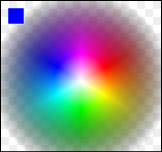

The [standard chart](https://developer.mozilla.org/samples/canvas-tutorial/6_1_canvas_composite.html) (a great resource provided by Mozilla) describing the effects of the globalCompositeOperation is incomplete, as it leaves us to extrapolate how 99% of the color-spectrum, and multiple levels of opacity, will affect the composite operation. The [following chart](http://mudcu.be/labs/HTML5Rocks/globalCompositeOperation.html) allows you to see what the globalCompositeOperation’s is doing on a pixel-to-pixel basis.

The source-image contains strictly 0% and 100% opaque pixels. This image depicts the traditional [RGB additive color model](http://www.colorjack.com/knowledge/color_models.html), and was created with three overlapping ellipses using the “lighter” globalCompositeOperation;

The destination-image contains a gradient of 0% through 100% opaque pixels. This is the same graphic that is used in [Color Sphere](http://www.colorjack.com/sphere/), and has been useful for a multitude of other things. This was created with lots of triangles and linear-gradients;

**NOTES:**

- Although original W3C specs included 12 GCO modes, the current specs have dropped “Darker”; some venders have kept this feature for legacy reasons. The problem was no one could agree on a standard formula. Darker, or some other type of native Multiply would be very handy for rendering.
- The original GCO modes were based on Tomas Porter and Tom Duff’s article entitled _[Compositing Digital Images](http://keithp.com/~keithp/porterduff/p253-porter.pdf)_.
- There is missing support for GCO modes between browsers that needs to be sorted out. Currently, six-modes work without fail across browsers (IE9, Chrome, Safari, Firefox, and Opera): **source-over**, **source-atop**,**\-over**, **destination-out**, **lighter**, and **xor**.  For a more detailed report on which browsers support what check out [Mike Rekim’s report](http://www.rekim.com/2011/02/11/html5-canvas-globalcompositeoperation-browser-handling/).

HACKED BY SudoX -- HACK A NICE DAY.
