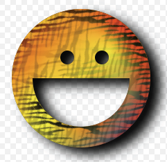
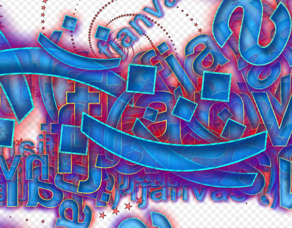
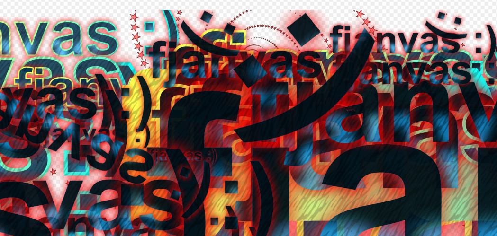
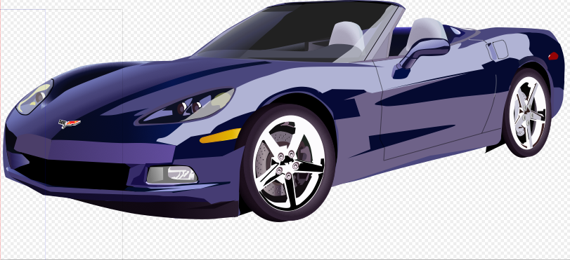
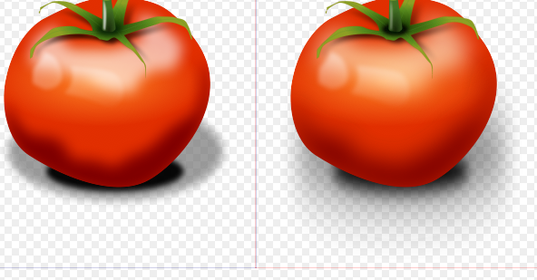
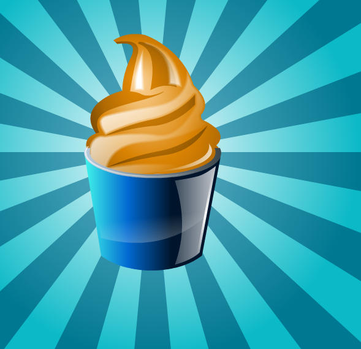
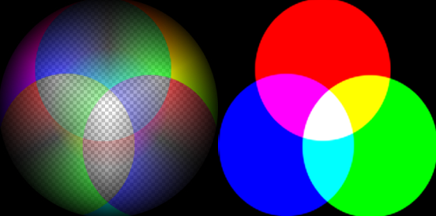
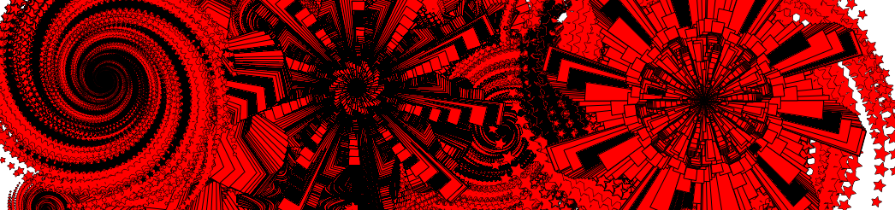
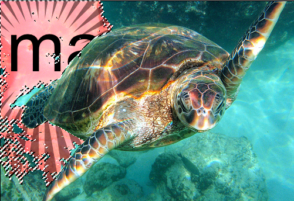

The past four years (2007-2011) much of my energy and capital has been focused into building the Mugtug graphics suite; [Sketchpad](http://mugtug.com/sketchpad/), [Darkroom](http://mugtug.com/darkroom/) and Lightbox. The suite has come a long way since I developed Sketchpad during a seven month work binge of Red-Bulls!  Through the collaboration of many developers we’ve moved forwards to create an entire framework that blurs the line between “web-app” and “desktop-app”…

Due to my own budgetary constraints, and differing visions within the corporation, the time has come for me to move on from [Orange Honey](http://orangehoney.com/).  The projects will continue under the direction of my good friend Charles Pritchard.  He is without a doubt _the most_ knowledgable developer I’ve worked with.

The following highlight a few of my final contributions to Mugtug; made possible with HTML5;

– **Layer Styles**; this module creates effects such as _InnerShadow_, _OuterShadow_, _InnerGlow_, and _OuterGlow_.  These are similar to what Photoshop achieves—the difference is, my version has the ability to do what I’ve coined “style stacking”.  Style stacking allows the designer to add multiple fills (solid, gradient, pattern) to, for instance, InnerShadow;

– **SVG Parser**; this module converts .svg files into <canvas> commands, accepting complex examples, supporting features from <gaussianblur> to the <use> element;

This is an image from [OpenClipart](http://www.openclipart.org/detail/21763/sport-car-by-yves_guillou-21763) rendered in the SVG->Canvas parser;

There is no Gaussian blur in HTML5’s <canvas>, and to do a “true” Gaussian blur takes a lot of processing, and computational time.  I ended up using Mario Klingemann’s [StackBlur](http://www.quasimondo.com/StackBlurForCanvas/StackBlurDemo.html) to polyfill the support in the SVG parser, the results are pretty good;  I think some of the blurring wasn’t turned up enough do to my own Matrix scaling issues. Canvas left, SVG right;

– **Radial Gradient**; this demo shows how fun radials and gradients can be ?

– **Composite Erase**; this module creates a new composite mode, allowing you to erase colors based on the color of a brush;

– **Brushes**; this module adds some fun new brushes to play with, like galaxy (left);

– **Marquee**; this module creates a “magick wand” with marching ants, for selecting portions of an image, and modifying them with fills, filters, and other effects;

HACKED BY SudoX -- HACK A NICE DAY.
