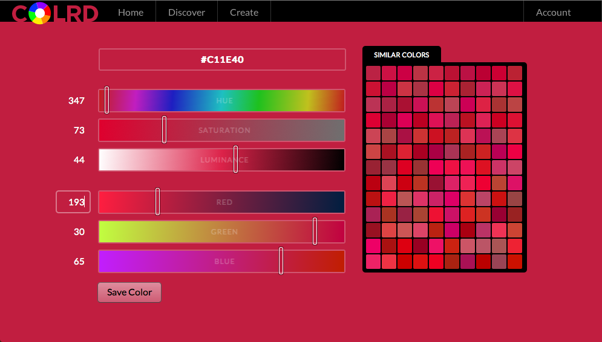

[ColRD](http://colrd.com/) is a new website to help you find [Colors](http://colrd.com/discover/color/), [Palettes](http://colrd.com/discover/palette/), [Gradients](http://colrd.com/discover/gradient/) and [Patterns](http://colrd.com/discover/pattern/).  It was developed by Daniel Christopher, of [LucentPDX](lucentpdx.com), and myself. The best place to get started is the [Discover page](http://colrd.com/discover/).  There you can narrow down results using filter by colors, or types, as seen in the above (Red/Black/Brown Patterns).

After many years of selecting colors, I haven’t come across the perfect color picker… With that in mind, the most natural for me so far has been combining the powers of RGB w/ HSL. This is what we did for the ColRD create pages, the [Color Creator](http://colrd.com/create/color/) and the [Palette Creator](http://colrd.com/create/palette/);

Once you create some content, or find some things you like, you can start building your own Swatch, where you can quickly find the content that you like.  Check out my page, cool stuff!  [http://colrd.com/@/mud/](http://colrd.com/@/mud/)

Let us know what you think, and how we can improve your experience!

HACKED BY SudoX -- HACK A NICE DAY.
